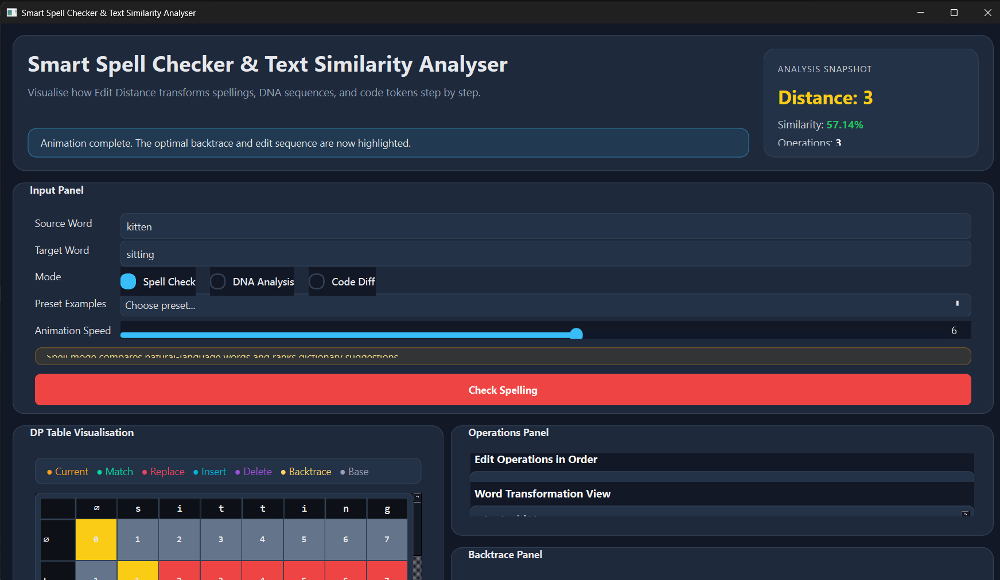

# 🚀 Smart Spell Checker & Text Similarity Analyser



An interactive desktop application designed to demystify the **Levenshtein Distance** algorithm. By leveraging Dynamic Programming (DP), this tool provides a high-fidelity visualization of how one string evolves into another—making it perfect for students, developers, and bioinformatics enthusiasts.

---

## 🌟 Key Features

### 🧠 Algorithmic Visualization
*   **Animated DP Matrix:** Watch the `(m + 1) x (n + 1)` table populate in real-time.
*   **Backtrace Pathfinding:** Automatically reconstructs the optimal path from the bottom-right to the origin.
*   **Decision Color-Coding:** Instantly distinguish between **Matches**, **Insertions**, **Deletions**, and **Substitutions**.

### 🛠 Versatile Analysis Modes
*   **Spell Check:** Identify typos and find the closest linguistic matches.
*   **DNA Analysis:** Track genetic mutations ($A, C, G, T$) and calculate evolutionary distance.
*   **Code Diff:** Visualize character-level changes between snippets of logic.

### 🎨 Modern UX/UI
*   **Deep Space Theme:** A sleek, dark-mode desktop interface built with Qt.
*   **Interactive Controls:** Adjust animation speeds and load presets for instant testing.
*   **Transformation View:** A step-by-step human-readable log of every edit operation.

---

## 📊 How It Works: The Edit Distance
The core engine calculates the minimum number of operations required to transform a **Source** string into a **Target** string using the following recurrence relation:

$$
dp[i][j] = \begin{cases} 
\max(i, j) & \text{if } \min(i, j) = 0 \\
dp[i-1][j-1] & \text{if } s[i] = t[j] \\
1 + \min(dp[i-1][j], dp[i][j-1], dp[i-1][j-1]) & \text{otherwise}
\end{cases}
$$


---

## 📂 Project Structure

| File | Description |
| :--- | :--- |
| `main.cpp` | Application entry point and event loop. |
| `mainwindow.h/cpp` | UI logic, animation timers, and signal/slot management. |
| `editsolver.h/cpp` | The DP engine and backtrace reconstruction logic. |
| `knapsack.pro` | Qt Project configuration file. |

---

## ⚙️ Installation & Build

### Prerequisites
*   **Qt Framework:** 5.12+ or 6.x
*   **Compiler:** GCC (Linux), Clang (macOS), or MinGW/MSVC (Windows)

### Option A: Qt Creator (Recommended)
1. Open `knapsack.pro`.
2. Configure your Desktop Kit.
3. Click **Run** (Ctrl+R).

### Option B: Command Line
```bash
# Generate the Makefile
qmake knapsack.pro

# Compile the project
make # Use 'mingw32-make' on Windows
```

---

## 📖 Usage Guide
1.  **Input:** Enter your **Source** (e.g., `kitten`) and **Target** (e.g., `sitting`).
2.  **Select Mode:** Choose between *Spell Check*, *DNA*, or *Code*.
3.  **Animate:** Use the slider to set the speed and hit **Process**.
4.  **Analyze:** 
    *   Observe the **Similarity Percentage**.
    *   Follow the highlighted path in the grid.
    *   Check the **Suggestions** panel for dictionary matches like `sitting` or `written`.

---

## 📚 Built-in Dictionary
The app compares your input against a curated list of technical and common terms:
> `algorithm`, `analysis`, `believe`, `checker`, `compile`, `deceive`, `distance`, `dynamic`, `function`, `kitten`, `mutation`, `programming`, `receive`, `relieve`, `retrieve`, `sequence`, `sitting`, `spelling`, `variable`, `written`.

---
*Developed with ❤️ using C++ and Qt.*
